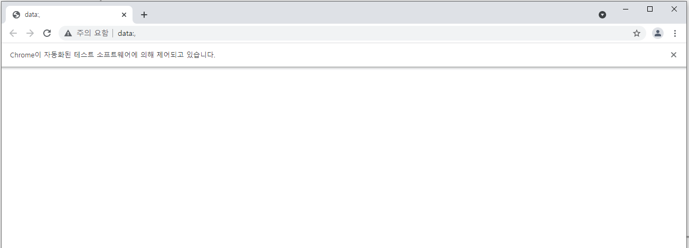
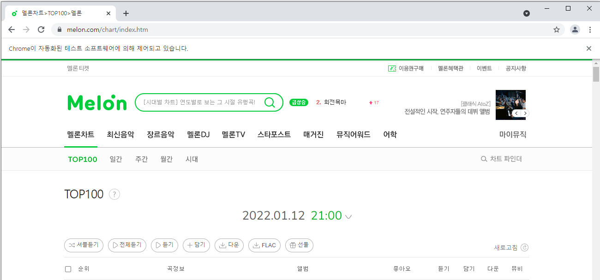

# 멜론 노래 순위 정보 크롤링

1.  selenium 라이브러리 불러오기 및 크롬드라이버 실행

```python
from selenium import webdriver
from selenium.webdriver.chrome.service import Service

ser = Service('../chromedriver/chromedriver.exe')
driver = webdriver.Chrome(service = ser)
```




2. 멜론 인기차트 웹페이지 접속

```python
url = 'https://www.melon.com/chart/index.htm'
driver.get(url)
```



3. HTML 다운로드 및 BeautifulSoup 읽기

```python
from bs4 import BeautifulSoup

html = driver.page_source
soup = BeautifulSoup(html, 'html.parser')
```


4. 100개의 노래 태그 찾기

```python
songs = soup.select('tbody > tr') # 곡 정보 포함된 tr태그 찾기
song =  songs[0] # 한개의 곡 정보 저장
```


......